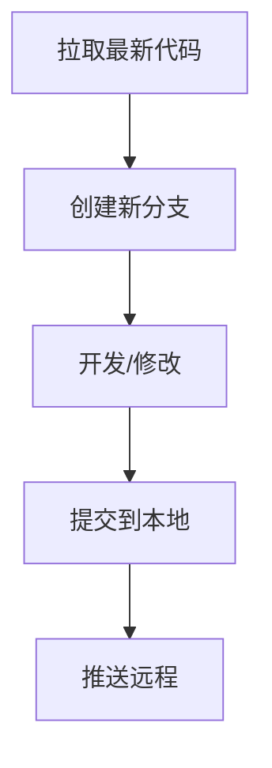

# sky-courier-site
## 项目运行说明
1. python == 3.9.21 
2. 克隆仓库
```bash
git clone https://github.com/czx0v0/sky-courier-site.git
```
3. 进入目录
```bash
cd sky-courier-site
```
4. 需安装库见 requirement.txt(可选手动安装) 
```bash
# 直接运行可能会出错，可以手动安装
pip install -r requirements.txt
```
5. 🌟在根目录下，运行
```bash
streamlit run sky-courier-site.py
```
## 工作流程

## 协作指南
### git配置
```bash
# 配置身份（在Git Bash运行）：
git config --global user.name "你的名字"
git config --global user.email "你的邮箱"

#  方案1: 临时用 HTTPS
# Push 时输入用户名 + GitHub Personal Access Token（代替密码）

# 方案2: 使用 SSH 协议
git remote set-url origin git@github.com:czx0v0/sky-courier-site.git
# ...其他配置...
# 生成密钥（如果还没有）
ssh-keygen -t ed25519 -C "your_email@example.com"
# 将公钥添加到GitHub
cat ~/.ssh/id_ed25519.pub
# 在 GitHub: Settings > SSH and GPG keys 添加公钥
```
### 工作提交
```bash
# 1：每次开工前同步
git pull origin main

# 2：创建新分支（分支名）
git checkout -b zhixing

# 3：修改文件
# 4：添加改动（注意空格）
git branch -v
git add .                         # 添加所有修改
或
git add 文件名.txt                # 添加特定文件

# 5：提交（消息备注）
git commit -m "增加sky-courier-site.py"

# 6：推送到远程
git push origin zhixing
```
