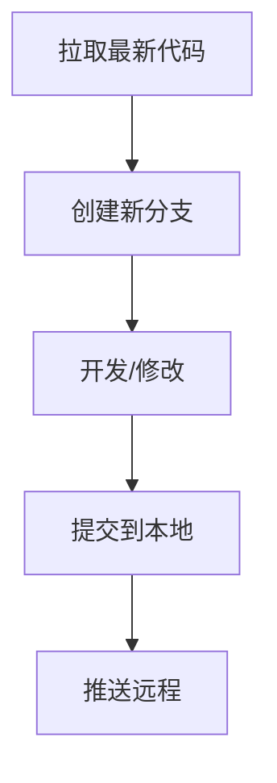

# sky-courier-site
## 项目运行说明
1. python == 3.9.21 
2. 克隆仓库
```
git clone https://github.com/czx0v0/sky-courier-site.git
```
3. 进入目录
```
cd sky-courier-site
```
4. 需安装库见 requirement.txt(可选手动安装) 
```
pip install -r requirements.txt
```
5. 在根目录下，运行
```
streamlit run sky-courier-site.py
```
## 工作流程

## git
### git配置
```
配置身份（在Git Bash运行）：
git config --global user.name "你的名字"
git config --global user.email "你的邮箱"
```
### 工作提交
```
# 1：每次开工前同步
git pull origin main

# 2：创建新分支（分支名）
git checkout -b zhixing

# 3：修改文件
# 4：添加改动（注意空格）
git branch -v
git add .                         # 添加所有修改
或
git add 文件名.txt                # 添加特定文件

# 5：提交（消息备注）
git commit -m "增加sky-courier-site.py"

# 6：推送到远程
git push origin zhixing
```
